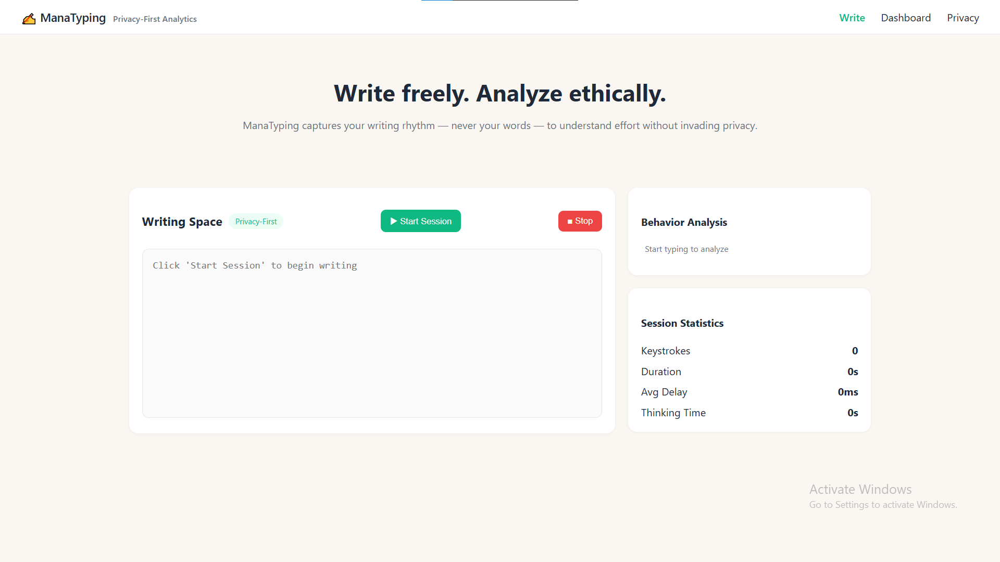
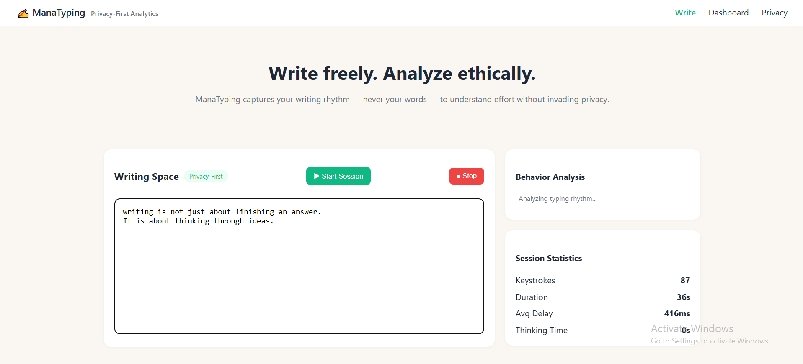
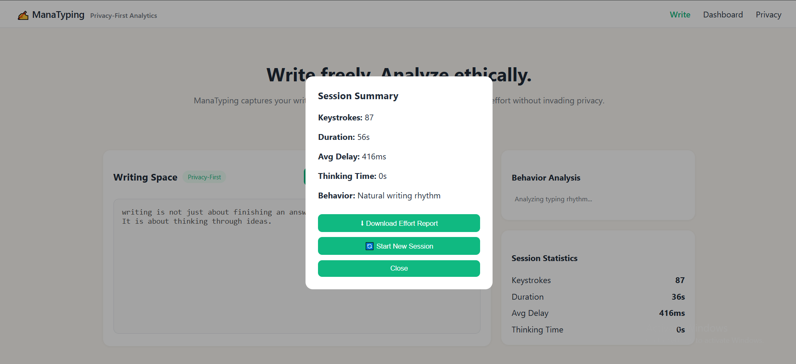
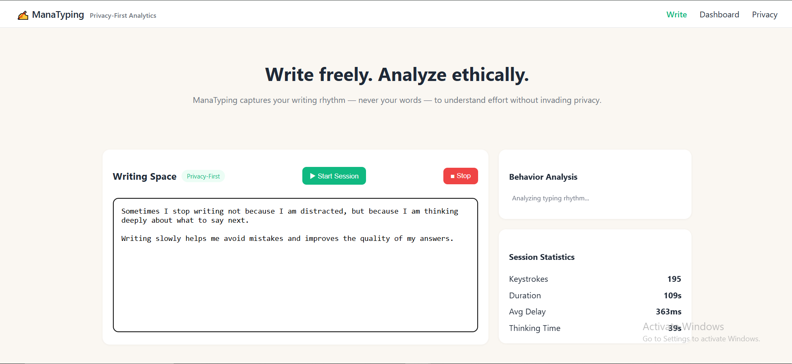
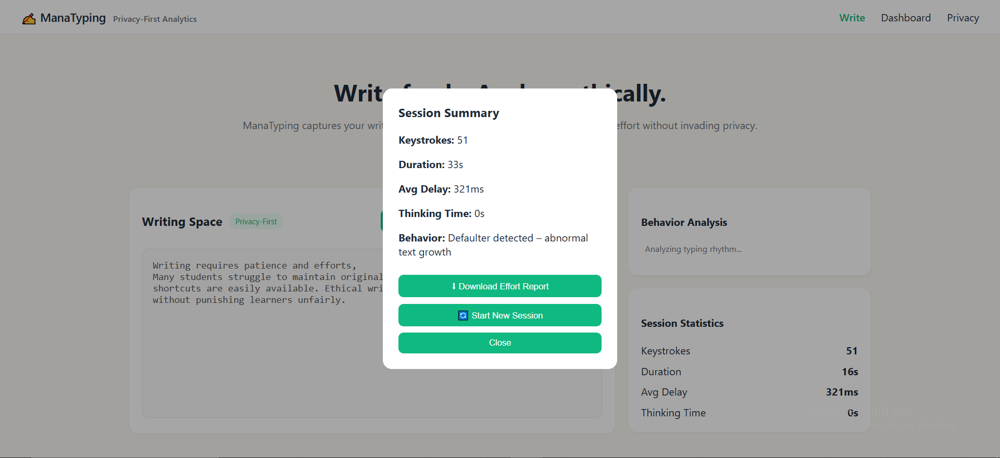

# ✍️ ManaTyping – Feel the Rhythm of Real Writing

**WIN15 | Privacy-First Writing Analytics**

ManaTyping is a privacy-first writing analytics prototype that helps understand writing effort and thinking patterns **without ever reading or storing written content**.

Instead of analyzing _what_ is written, ManaTyping reflects _how_ writing happens — through typing rhythm, pauses, flow, and content-growth behavior.

---

## 🌍 Inspiration

In the heart of Hyderabad, near the iconic Charminar, educators noticed students struggling to build genuine writing habits amid distractions and shortcuts.

> “True learning shows in how someone thinks and types their own words — not just what they produce.”

ManaTyping was born over cups of dum chai and bun maska with one simple belief:

**Writing is a rhythm, not just a result.**

---

## 🎯 Problem Statement

Most writing evaluation tools:

- inspect content,
- invade privacy,
- and misjudge genuine effort.

Educators need a way to understand whether students are thinking, rushing, or relying on shortcuts **without reading or analyzing the text itself**.

---

## 💡 Our Solution

ManaTyping focuses on **behavioral signals instead of content**.

It analyzes:

- typing rhythm,
- thinking pauses,
- flow consistency,
- abnormal content growth (copy-paste patterns),

to ethically reflect **writing effort and authenticity**.

---

## ✨ Key Features

### ▶️ Session-Based Writing

- Explicit **Start Session / Stop Session**
- No background tracking
- User-controlled analytics

### ⌨️ Typing Rhythm Analysis

- Measures inter-key delays
- Identifies steady vs irregular typing flow

### ⏳ Thinking Time Detection

- Pauses longer than **5 seconds** counted as reflection
- Separates typing from thinking

### 🚫 Copy-Paste Detection (Privacy-Safe)

- Detects abnormal content length growth rate
- Flags input faster than human typing speed
- ❌ No clipboard access
- ❌ No content inspection

### 📊 Writing Flow Timeline

- Visualizes typing bursts, pauses, and spikes
- Reveals thinking patterns over time
- No text or word analysis

### 📈 Session Insights

After ending a session, users see:

- Total keystrokes
- Session duration
- Average typing delay
- Thinking time
- Behavioral classification _(Natural / Reflective / Defaulter)_

### ⬇️ Effort Report Download

- Download **analytics-only** report
- No written content included

### 🔄 Restart Session

- Clean reset for a new attempt
- No data leakage between sessions

---

## 🔐 Privacy-First by Design

ManaTyping **never**:

- stores written text,
- analyzes words or sentences,
- accesses clipboard data,
- runs plagiarism or AI content checks.

ManaTyping **only** uses:

- timestamps,
- inter-key intervals,
- numeric content length changes.

**Effort without exposure. Insight without intrusion.**

---

## 🧠 How Copy-Paste Detection Works

We calculate:
(content length increase) ÷ (time elapsed)

If the growth rate exceeds safe human typing limits, the session is flagged as:

**Possible abnormal input (Defaulter)**

✔ Content-agnostic  
✔ Privacy-preserving  
✔ Works from the first session

---

## 🏗️ Tech Stack

### Frontend

- HTML
- CSS
- JavaScript  
  _(React-compatible structure)_

---

## 🎤 One-Line Pitch

> “ManaTyping visualizes how thinking unfolds during writing — using rhythm and timing — without reading a single word.”

---

## 🏆 Why ManaTyping Is Unique

- ❌ Not plagiarism detection
- ❌ Not AI content evaluation
- ❌ Not surveillance

✅ Ethical  
✅ Reflective  
✅ Human-centric

---

## 🖥️ Application Screenshots & Walkthrough

Below is a visual walkthrough of ManaTyping, demonstrating how the system behaves under different writing patterns.

---

## 🏠 Homepage – Writing Interface

This is the landing view where users begin a writing session.  
It provides a distraction-free editor with explicit session controls.

**Highlights**

- Clean writing space
- Start / Stop session controls
- Privacy-first indicator
- Live session statistics panel

---

## 🟢 Natural Writing Rhythm

These screenshots show **normal, continuous typing** with minimal pauses.  
The system detects a **natural writing rhythm** without any flags.

**Detected Behavior**

- Steady typing speed
- Minimal thinking pauses
- Classified as **Natural writing rhythm**

---

## 🟨 Reflective Writing (Thinking-Heavy)

These screenshots demonstrate **long pauses between typing**, indicating reflection and thought.

**Detected Behavior**

- Significant thinking time
- Slower typing rhythm
- Classified as **Reflective writing detected**

---

## 🔴 Copy-Paste / Defaulter Detection

These screenshots show **abnormal text growth in very short time**, simulating copy-paste behavior.

**Detected Behavior**

- Sudden spike in content length
- Growth rate exceeds human typing limits
- Classified as **Defaulter detected – abnormal text growth**

> ⚠️ Detection is based purely on **content length vs time**, not clipboard access or text analysis.

---

## 🔮 Future Enhancements

- Teacher analytics dashboard
- Flow Score (0–100)
- Interactive writing flow timeline
- Writing modes (Exam / Practice / Journal)

---

## 📜 License

Built as a hackathon prototype for educational use.
